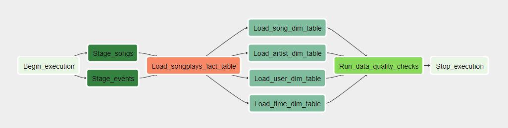

## Introduction

This project has the purpose to extract data about events and songs at Sparkify from JSON files and load it into Redshift tables.

## Tables

There are 5 tables. 

Four dimensions tables: 

- users
- songs
- artists
-  time 

And one fact table: 

- songplays

## Process

Firstly, the data is loaded into two staging tables into redshift, then, the data are extracted from these tables to fact or dimensional tables. At the end of the process, there are some data quality checks to certify the data was correctly processed.

## Connections

Before starting to use Airflow pipeline, it's necessary to create a connection variable on Airflow for S3. The conn ID must be "aws_credentials" and the type "Amazon Web Services", at this conn you need to insert your **Access key ID** and **Secret access key** as **login** and **password**. You should create another connection to Redshift, the name must be "redshift" and the type "Postgres", you must complete the **host**, **schema**, **login**, **password** and **port** information.
